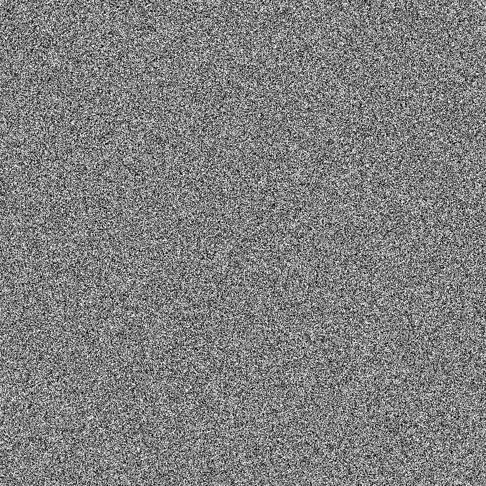
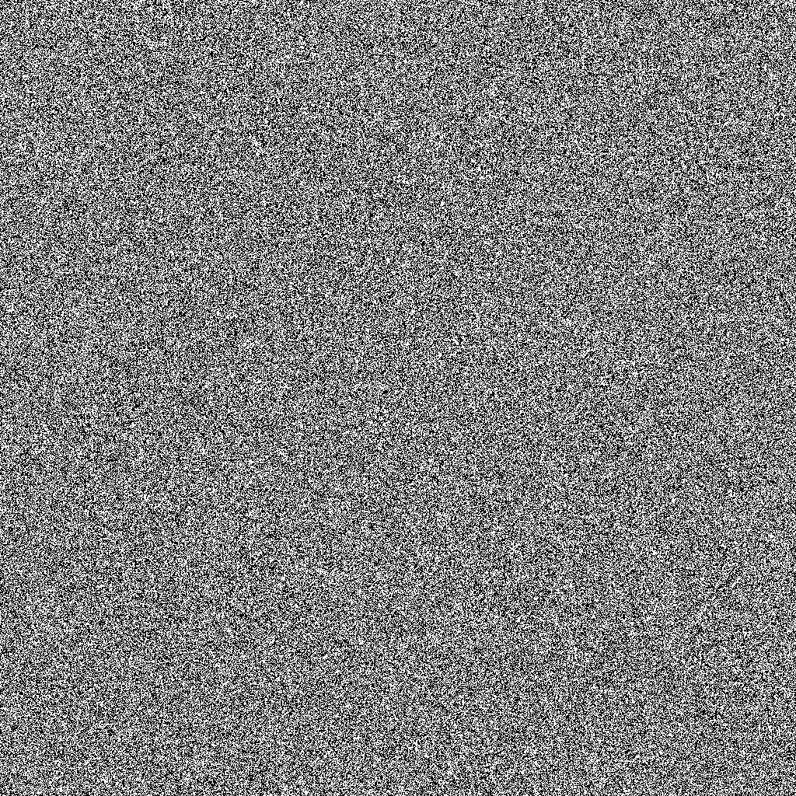

# randpath
Two-dimensional 1024 bit pseudo random number generator

## Synopsis

This project provides two-dimensional 1024 bit pseudo random number generator.
It can start out with a random number pulled from "/dev/urandom", and then progress in two directions (south and east). On each move, a modified random number is generated.
If you use the same seed, you will always get the same (i.e. reproducible) results from moving south/east.

For an example of the quality of the pseudo random number generator, see enclosed PNGs created with the test2 program:

### South test2 example image

1024 calls of rs_south() from common seed.

### East test2 example image

1024 calls of rs_east() from common seed.

## Building

To compile the test programs, run the following commands:
`gcc -Wall -o test_randseed test_randseed.c`
`./build-test2-randseed`

You have to install the GCC compiler (package "gcc" or "build-essential" or similar) and the "libpng" development package (package "ligpng-dev" or similar).
The source code has been written for and tested with Linux only.

## Usage

Currently, there's no makefile. Simply include "randseed.c" into your program, or create your own makefile. The header file, "randseed.h" contains all the datatype and function declarations.

Build the test programs as described in the previous section, and run them.

### test_randseed Program

This program creates a random seed from "/dev/urandom" and then goes into an infinite loop that calls rs_south() and rs_east() on copies of the original seed. It prints the core seed values of every iteration.

### test2_randseed Program

Similar to "test_randseed", but instead of going into a printing loop, runs 1024 iterations and writes 2 PNG files (see images in this document). Each image row contains the 1024 bits of the core seed value of each iteration. 
This test program makes it easy to evaluate the quality of the distribution of generated pseudo random numbers.

## Reference

### rs_init()

Initialize a seed with data from "/dev/urandom". The sv and ev vectors are set to constant values (that I have sourced from "/dev/urandom" as well).

### rs_copy()

Copies a seed and its sv and ev vectors from source to target. NOTE that if you store a seed, you have to store the entire structure, unless the sv and ev vectors are unchanged from the default.

### rs_south()

Moves a seed "south", i.e. apply algorithm for dimension 1.

### rs_east()

Moves a seed "east", i.e. apply algorithm for dimension 2.

### rs_print()

Print the contents of the core seed value to standard output. The sv and ev vector contents are NOT output at this time.

